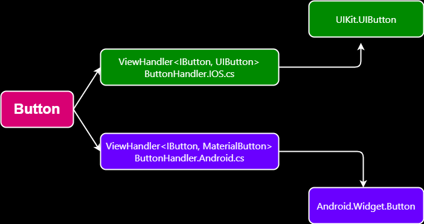

# What problem does `.NET MAUI` Solve?

At the core, you want to build an app for Windows, macOS, Android and iOS and share as much of the code as possible.

- You want to get your products to market faster. There's no point in writing the same code twice when you only have to write it once.
- You want to avoid having development silos. Shops that have separate teams for each platform can have issues with communication and collaboration. You don't want to have the Android team or the iOS team, you want to have the development team.
- You want to have shared code for the business objects. If your back‑end code is already written in C#, you may be able to use the same data models in your mobile app with little to no changes.
- You want to have a consistent user experience across all the platforms. You want your app to look and feel like a native app on each platform.

## The Benefits of Using `.NET MAUI`

As mentioned before, the acronym ***MAUI*** of `.NET MAUI` stands for ***`M`ultiplatform-`A`pplication-`UI`***
. Most people will call it MAUI. Microsoft always calls it `.NET MAUI`. For this workshop, we will follow how Microsoft refers to it.

You can use the same code to create an app for both Android and iOS, and you can also target macOS desktop and Windows desktop. These are the platforms officially supported by Microsoft. There are open source initiatives to support other platforms. For example, Samsung has contributed code to support `.NET MAUI` under Tizen operating system.

## XAML

While you can still have platform‑specific code, most of the code will be shared. The UI can be defined using **XAML**.

- XAML is an XML‑based market language that lets you define the UI in a declarative manner. If you've created Windows desktop apps with WPF, UWP, or WinUI, then you've already used XAML.
- Use the Same Code for All the Platforms.

## UI Abstraction

The ***`.NET MAUI` UI control*** is an abstraction that will map to a native control or a collection of native controls.

At runtime, the controls are rendered using the native controls for the platform. An Android app is going to look and feel like an Android app built with the native toolkits, and the same goes for iOS and Windows.

The common controls for the platforms are represented in `.NET MAUI`, controls like buttons, labels, entry fields. They are all part of the standard set of controls.

Custom controls can be built with `.NET MAUI`, and it comes with controls that are not part of the native control set on each platform.

We can use the `.NET MAUI` button control to show how the abstraction works.

This is an over simplification of what goes on under the hood, but as a model, it's close enough. At design time, you add a button to a page. At runtime, a button handler will be called. They'll implement the IButton interface.

- On iOS, this will be part of the iOS platform code. The handler will create an instance of a UIKit.UIButton, which is the native button control on iOS.
- On Android, the ButtonHandler will be in the Android platform code. A widget button will be created for the native Android button.
- This works in the same way for the other platforms.

Even with the abstractions, you can still directly access the native platforms and work with platform‑specific controls and functionality. That is part of the power of working with `.NET MAUI`. It's not all or nothing. You pick and choose what to use.

## C\#

By defining your business logic with C#:

- You can access the UI with C#.
- You can share your data models for your web applications.- By using one set of code for all the platforms, you can roll out updates and security fixes in less time.

With C#, you get the same language that you can use for the web and for desktop and for mobile. You don't have to do the mental context switch of using C# to define a web service and then having to write Java or Kotlin code to consume that service from Android and then having to write Objective‑C or Swift on iOS to consume that service. That's a lot of different languages to know and to be able to work with.

You're picking up the power of the .NET Framework. The modern async and await patterns are there and work in the same way for both Android and iOS.

As `.NET MAUI` is open source, you can look at the code to see how a control was implemented so you can extend it or build your own. You have access to many of the hugely popular libraries that are available for .NET. You'll also have access to commercial component libraries for when you need a complicated control that doesn't come with the base framework.

## Tooling

As far as tooling, Visual Studio is a powerful IDE with extensive refactoring and debugging tools. There are multiple test frameworks available such as NUnit. You can create mock data and define a full test suite for your app.

Microsoft has a service called App Center Test where you can deploy apps to a wide range of physical devices and run tests on those devices.

Continuous integration and continuous deployment work well with `.NET MAUI`. With source repository services like GitHub, you can define workflows that will get run when you check the code in. That workflow can verify that the app builds and passes any and all of the unit tests that you define for it. When you push your code to production, you can have a workflow that submits the app to the apps stores.

`.NET MAUI` is a Microsoft product and is fully supported. It's part of the .NET Framework and is updated when .NET is updated. Their online documentation is top notch and comes with sample code that you can use for your own projects.

[Next: Alternatives to .NET MAUI](4-Alternatives.md)