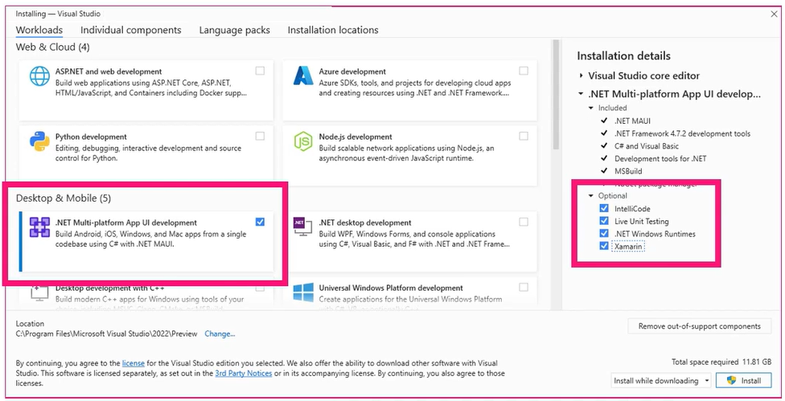

# Hardware and Software Requirements

We're going to look at what you need to set up in order to start building apps with `.NET MAUI`.  You'll need the development hardware. And you need the development software to build the apps. Since this is a `.NET MAUI` workshop, you'll need the tools for building `.NET MAUI` apps.

## Development Hardware

You can use `.NET MAUI` to build applications for both Windows and the Mac. With that in mind, the focus of this workshop is for Windows so I'll just mention that if you ever plan to start development for iOS requires a macOS device. Most mobile developers that I know use a MacBook. Apple has two basic MacBook product lines, the MacBook Air and the MacBook Pro. Either one will do. The current lineup of Apple Silicon Macs has more than enough CPU power for `.NET MAUI` development. If you're on a tight budget, you can use a Mac Mini.

For developing on Windows, you'll want a fast Windows 10 or 11 machine with lots of RAM and storage. I would say that 16 GB is the minimum amount of RAM that you will need. I would also suggest 512 GB as a baseline for storage. The more memory and storage that you have, the better off you will be.

*What about testers?* Testers don't need to have the same development machines used to build the apps, but they do need access to the apps.

## Developer Software

You'll need the latest version of [Visual Studio 2022](https://visualstudio.microsoft.com). There are multiple editions of the Windows version. Students, hobbyist developers, and opens source contributors can use the free Community edition. Commercial developers can use either the Professional or Enterprise editions, depending on their requirements. On the Mac, there is just one edition. For `.NET MAUI` development, any of the editions can be used. You can download Visual Studio from [visualstudio.microsoft.com/downloads](visualstudio.microsoft.com/downloads). That page will provide links to both the Windows and Mac versions.

### Android SDK

The Android SDK is installed when you install Visual Studio and select the mobile workload. It will install the latest Android SDK, and you can install other versions later via the Android SDK Manager. It will install the Android Emulator with a base emulator image. If you need more emulator images, the Android Device Manager will download additional images as needed. These Android tools are directly accessible from within Visual Studio.

### iOS SDK

*Again, the focus during this workshop will be on Windows development. If you're going to be building iOS apps, you'll need a Mac. You'll also need to install Xcode on your Mac as it is required for iOS and macOS development. Even if you're doing the work on a Windows machine, it still uses Xcode on your Mac to build and run the iOS and macOS versions of your app. This is an Apple requirement.*

***Mac Catalyst** is an Apple technology that allows a developer to compile iPadOS apps as MacOS apps.*

### Visual Studio Install

When you download Visual Studio for Windows, you'll be downloading a small installer. When you run the installer, you'll be prompted for the various optional workloads to install. You will need to install the mobile work load.

Under Workloads, make sure that .NET Multi‑platform App UI development is selected. Under Optional, make sure that Xamarin is checked. Select any other workload that you may need and then press the Install button. This will install Visual Studio and the libraries needed to build and run `.NET MAUI` apps. If you already have Visual Studio installed, you can just run the installer again and select .NET Multi‑platform App UI development and the Xamarin options. That will update your Visual Studio to include the `.NET MAUI` tools.

## Developer Accounts

Although the subject of publishing to the various app stores, to do so you'll need to register developer accounts with the various app stores.

We'll just quickly mention them:

### Apple App Store

In the case of Apple, you will not be able to even build the app without a Developer account. iOS, iPadOS, and macOS apps are listed in the Apple App Store. For the Apple App Store, you will need to register an account for the Apple Developer program.

### Google Play Store

For the most part, Android apps are listed in the Google Play Store. There are other non‑Google app stores for Android apps. That is a topic beyond the scope of this workshop.

### Microsoft Store

You'll need a Microsoft Store account if you plan on listing your app in that store. You can register as an individual. You can also register as an organization and have individuals be members of a team.

For the most part, the team members will be app developers.

Testers can also have accounts, and project managers can also be members of the team.

You have a couple of options for distributing your apps. You can create a self‑signed MSIX file and deploy that app within your enterprise. An MSIX file is a Windows app package format to make app deployment robust and secure on Windows. You can also publish the MSIX to the Microsoft Store. Microsoft's app Store is named the Microsoft Store. You need an account to be able to place apps in their store. You can have individual and organization accounts. You provide your contact and/or organization details. There is a one‑time registration fee. For more information on registering an account on the Microsoft Store and deploying apps to it, please visit [developer.microsoft.com/microsoft‑store/register](developer.microsoft.com/microsoft‑store/register).

[Next: 6 - Creating a New Project](6-Creating-a-New-Project.md)