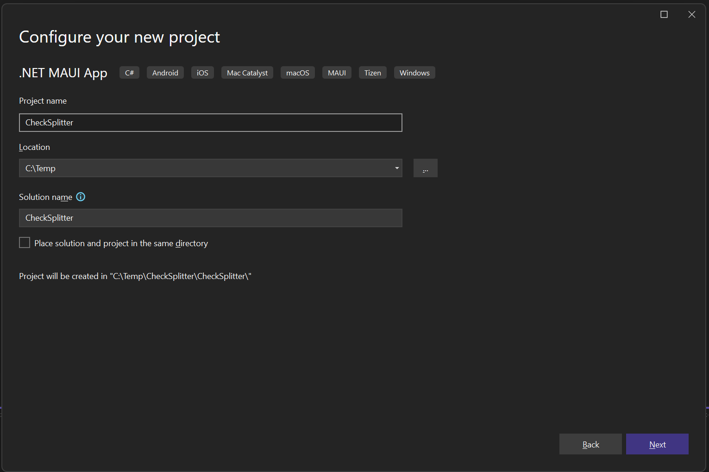
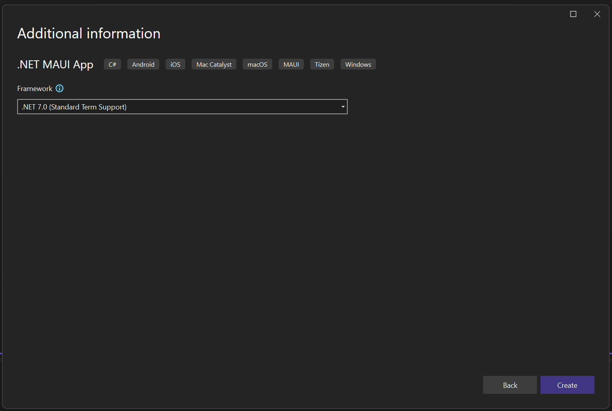
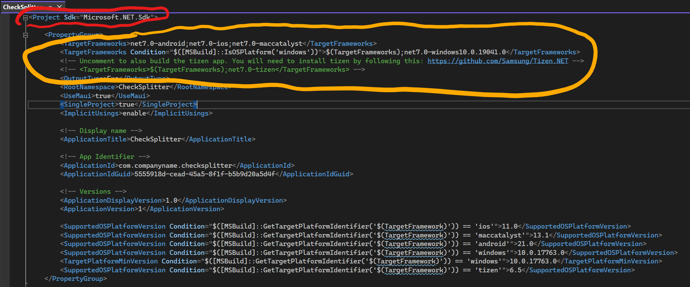
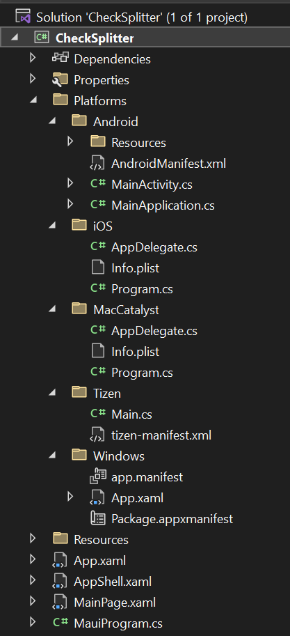
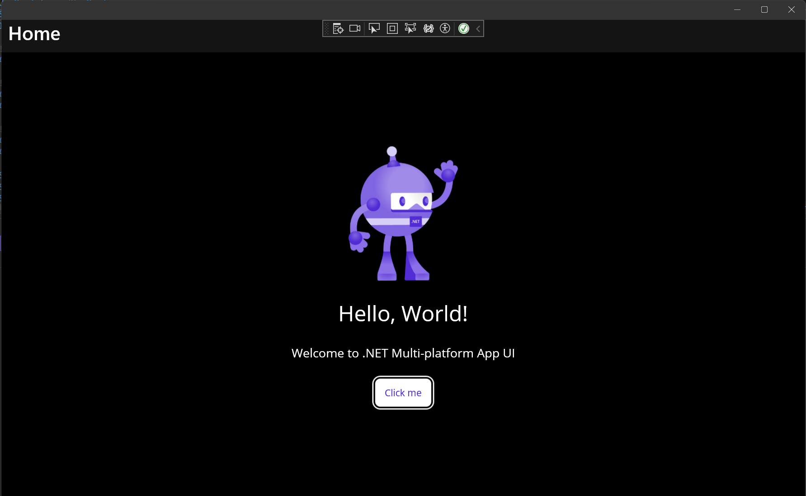

# How to Build a `.NET MAUI` Application

We're going to take a look at using the tools by building a "check splitter" application. Before we jump in, let's talk a little about the MVVM design pattern that'll be used as part of the data binding. We'll create an application from scratch. Then, we'll run the app on Android. And we'll end our demo by running it as a Windows desktop app.

## Overview of the Model-View-ViewModel (MVVM)

MVVM is used for data binding. We'll be using it in a demo to enable the data binding.

MVVM stands for **M**odel‑**V**iew‑**V**iew**M**odel, and it's a design pattern that Microsoft invented for WPF and Silverlight back in 2005.

- The "**model**" is your data model, it's whatever represents your data. It is usually just a class with fields and properties.
- The "**view**" is the view or page in your app. With `.NET MAUI`, this is usually a XAML file. It's whatever the user sees on the screen.
- You can think of the "**ViewModel**" as the center of the MVVM pattern.
  - It passes data to and from the model
  - It also passes data to and from the view
  - It can receive commands from the view.
  
A model should not have any references to a ViewModel, and the ViewModel should not have any references to the view that it's bound to. You do not always need a distinct model class to use with a ViewModel. You can use the MVVM pattern with just a ViewModel and a view. We'll be doing that with our demo.

## Creating a New Project

The best way to show how `.NET MAUI` can help you build high quality apps is to create one right now.

In Visual Studio, create a new project by navigating to `File` > `New` > `Project`

scroll through the list or even type MAUI into the search box to see the matching templates. Select the `.NET MAUI App` template.

Click the Next button.

Name the project `CheckSplitter`.

 Click `Next`.

When the "Additional information" page appears, you can select the target framework. Let's take .NET 7 as the framework.

Then click the `Create` button. The project is then created.

I double-click on the name of the project to open up the project file.

You can see it's an SDK‑style project. If you're coming from Xamarin.Forms, you are used to multiple projects, one for each platform. With `.NET MAUI`, it's a single project that can generate apps for multiple platforms.

The target frameworks shows which platforms can be built. Android, iOS, and Mac Catalyst can be built from both the Windows and Mac versions of Visual Studio. Windows Desktop can only be built from Visual Studio running on Windows, and the project file will check for that. Tizen is commented out. Tizen is an Android‑like operating system from Samsung, and Samsung has contributed the code to run `.NET MAUI` apps on Tizen.

In the Platforms folder, there are folders for each platform.

This allows you to add code and resources that are platform specific.

Now let's run the app. Select "`Windows Machine`" as the target and click the `Start` button.

Congratulations! You've just built your first `.NET MAUI` app.

You can learn more about creating a `.NET MAUI` application [here](https://learn.microsoft.com/en-us/dotnet/maui/get-started/first-app?tabs=vswin&pivots=devices-android).

[Next: Add functionality to it](7-Adding-Functionality.md)
