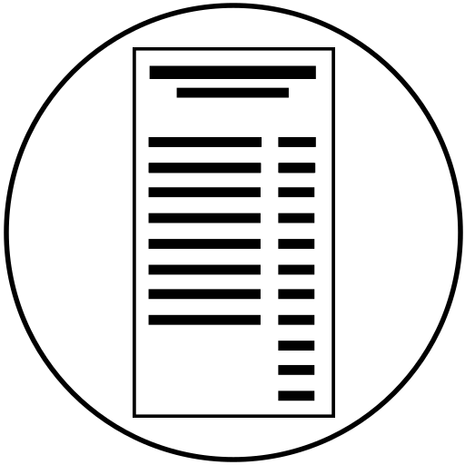
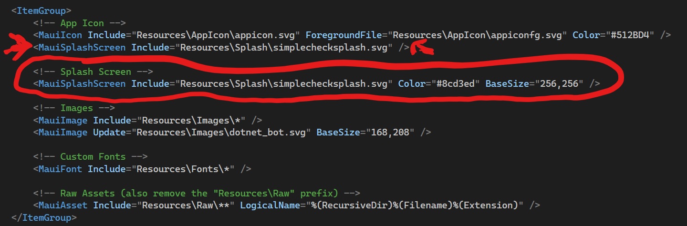
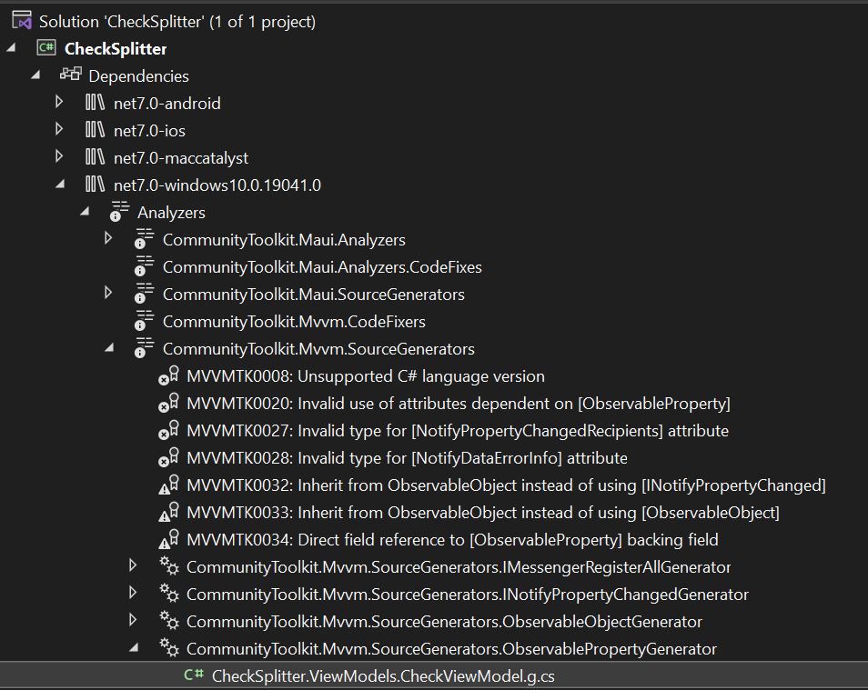

# Adding functionality to the "Check Splitter" app (Part 1)

## Splash Screen

One of the cool things you get with .NET MAUI is being able to provide SVG files for images. At compile time, the SVG files are rendered to PNG files at the appropriate resolutions for each platform. This means you don't have to create images for each resolution for Android and iOS. You still can if you want, but you can let .NET MAUI and Visual Studio do all the work for you. This also works for bitmap images.



Here is a simple SVG file to represent a restaurant check. Copy this file into the "Splash" folder in the Resources folder. Then right‑click on the Splash folder and select Add Existing Item. By default, the Add Existing Item dialog only shows source code files, so change it to show all the files. Now you can see the SVG file.

We'll use it as the splash screen logo. A cool feature of .NET MAUI, it's really easy to add a splash screen to your app. With Xamarin.Forms, you would have had to build a splash screen for each platform in .NET MAUI, it's just a setting in the project file. Right click on the file and select "Properties", then set the build action to MauiSplashScreen. At build time, that tells the compiler to take that image and convert it to the bitmap size for each platform and then use platform‑specific startup code to display the image when the app starts up.

Let's go back to the project file to adjust the splash screen settings.



Set the background color of the splash screen to the color that you're going to use as part of the app background, and increase the base size to 256 by 256 for some additional resolution. The source file is SVG, but it's being rendered as a bitmap, and this will set the base size.

Remove the default splash screen. You don't want to have two splash screens defined in the project file, that could confuse the compiler.

## Custom Font

We're going to include a custom font. .NET MAUI can use true type and open type fonts. I'm going to use a free font named Kastore, it will be included with the sample code. You can also download it from [here](https://www.behance.net/gallery/161626949/Kastore-font-Free-bold-weight). Copy the file to the Fonts folder in the Resources folder.

In the project, right‑click on the Fonts folder and select Add, then Existing Item. I drill down to the folder with the font. Having selected the font, I'll add it to the project.

To use the font, we have to register it within the app. We go to MauiProgram.cs, which is where we configure the app for anything special that needs to be done at startup. There is already a ConfigureFonts extension method with two fonts already registered. We add the font with the font name and an alias. We'll use the alias to specify when we want to use the font in our code

```csharp
builder.Services.AddFonts(new Font("Kastore", "Kastore"));
```

That is all you have to do to add a custom font that'll be available on each platform.

## NuGet Packages

Before we go any further, let's add a couple of NuGet packages. The first one is `CommunityToolkit.Maui`. The community toolkit is an open‑source library of .NET MAUI extensions, controls, and other things to make your life easier. We'll be using this when we define the view. Click Install and accept the license.

Let's make a quick change to the startup code. To use the .NET MAUI community toolkit, we need to add a line to initialize it. We go back to MauiProgram.cs. After the line, UseMauiApp, add UseMauiCommunityToolkit.

```csharp
.UseMauiCommunityToolkit()
```

The second package is the community toolkit MVVM package `CommunityToolkit.Mvvm`. The MVVM toolkit extends the community toolkit to add a quick and easy way to add MVVM functionality to your app. Click Install and accept the license.

One of the things to make your life easier is the MVVM source generator. It generates a boilerplate code that is required by the ViewModels to work with data binding. It uses the Roslyn Code Generator and generates the classes as you save the code. You can learn more about it at [learn.microsoft.com/.net/communitytoolkit/mvvm](learn.microsoft.com/.net/communitytoolkit/mvvm).

## Create a ViewModel

It's time to create a simple ViewModel and then wire it up. Add a `ViewModels` folder, and then inside that folder, add a `CheckViewModel` class. This class needs to descend from `ObservableObject`, and that adds `CommunityToolkit.Mvvm.ComponentModel` to the list of namespaces used for this class.

We start with the fields that the user would be expected to set from the UI. We have an amount field defined as double, the MVVM toolkit wants us to be in lowercase and starting with an underscore. At save time, a properly cased property will be created in a partial class. We add the ObservableProperty attribute, that's what tells the code generator that this needs to be a property. We have a tip percentage and the number of people to split the check with. I'll initialize that field to 1 to avoid any divide by 0 exceptions down the road. I'll save the file.

```csharp
using CommunityToolkit.Mvvm.ComponentModel;

namespace CheckSplitter.ViewModels;

public partial class CheckViewModel : ObservableObject
{
    [ObservableProperty]
    double _amount;

    [ObservableProperty]
    double _tipRate;

    [ObservableProperty]
    int _numPeople = 1;
}
```

This will kick in the source generator. I'm going to open up the Analyzers folder. This will be in the Dependencies folder and in the folder for the current platform. Then open CommunityToolkit.Mvvm.SourceGenerators.



In there, we have a partial class, and it's a partial class for our ViewModel with the public properties defined for the fields that we added.

Now let's add in a quick and simple roundup method. When you split a check, you can't have fractional sets.

```csharp
private double RoundUp(double amount)
{
    decimal n = 0;

    try
    {
        n = (decimal)amount;
        n = System.Math.Ceiling(n * 100) / 100;
    }
    catch (Exception ex)
    {
        Console.WriteLine(ex.Message);
    }

    return (double)n;
}
```

For real app, you might want to round up to even dollars to make it easier for people to chip in their share.

Now we'll define the calculated fields.

```csharp
public double Tip => RoundUp(Amount * (TipRate / 100.0));
public double Total => RoundUp(Amount + Tip);
public double PersonalAmount => RoundUp(Total / (NumPeople * 1.0));
```

Our tip is the amount times the tip rate divided by 100 and then rounded up. Our total is the amount plus the tip. Then a field named PersonalAmount, which will be the split value of the check. 

Notice that we're using the generated property names, not the underscore lowercase names.

To have the property changes work with the data binding, we add the NotifyPropertyChangedFor attribute for each property that needs to be updated.

```csharp
[ObservableProperty]
[NotifyPropertyChangedFor(nameof(Total))]
[NotifyPropertyChangedFor(nameof(Tip))]
[NotifyPropertyChangedFor(nameof(PersonalAmount))]
double _amount;

[ObservableProperty]
[NotifyPropertyChangedFor(nameof(Total))]
[NotifyPropertyChangedFor(nameof(Tip))]
[NotifyPropertyChangedFor(nameof(PersonalAmount))]
double _tipRate;

[ObservableProperty]
[NotifyPropertyChangedFor(nameof(PersonalAmount))]
int _numPeople = 1;
```

Let's add the notifications for Total, Tip, and PersonalAmount to the amount field. When the amount changes, it will notify any field that is using the Total, Tip, and PersonalAmount fields that they've been updated. Let's do the same for the tipRate field, and then set the notification for PersonalAmount to the numPeople field.

You can do a lot more ViewModels, but this will give us a taste.

We've done a fair amount of work. We're almost done...

[Next: Continue with the UI](./8-Adding-Functionality-Part2.md)
